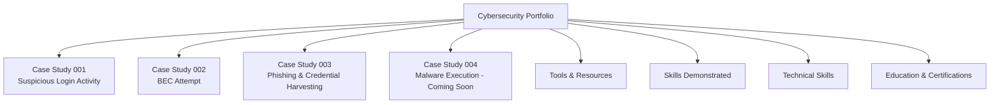

# 🛡️ Cybersecurity Portfolio

---

## 🧭 About This Portfolio
This portfolio showcases real-world SOC investigations I’ve completed using Microsoft 365 Defender, Azure AD, and KQL.  
Each case study demonstrates my ability to detect, analyse, and contain identity-based threats using enterprise security tools and structured incident response workflows.

---

## 🗺️ Portfolio Overview (Mermaid Diagram)

---

## 📁 Portfolio Contents

## 🧪 Case Studies (SOC Investigations)

| 🔢 Case | 📝 Title | 🧠 Focus Area | 🔗 Link |
|--------|----------|----------------|---------|
| **001** | 🔐 *Suspicious Login Activity — Microsoft 365* | Identity compromise, brute‑force detection, KQL investigation | [View Case Study](https://github.com/barryhuriwaka/soc-investigation-suspicious-logins) |
| **002** | 📧 *Business Email Compromise (BEC) Attempt* | MFA fatigue, inbox rule abuse, financial fraud prevention | [View Case Study](https://github.com/barryhuriwaka/Business-Email-Compromise) |
| **003** | 🎣 *Phishing & Credential Harvesting Attempt* | Phishing analysis, credential harvesting, MFA bypass attempt | [View Case Study](https://github.com/barryhuriwaka/Phishing-Credential-Harvesting) |
| **004** | 🖥️ *Malware Execution on Endpoint* | EDR triage, process tree analysis, PowerShell execution | *(Coming soon)* |

---

## 📊 Tools & Resources I’ve Built

| 🧰 Resource | 📄 Description |
|------------|----------------|
| 📝 **SOC Investigation Template** | A reusable template for documenting incidents |
| 🔀 **Triage Flowchart** | Visual guide for alert triage and escalation |
| 🗺️ **MITRE ATT&CK Mapping Guide** | Quick reference for mapping behaviours to ATT&CK |
| 🔍 **KQL Cheat Sheet** | Common queries for Microsoft Sentinel |
| ✍️ **Case Study Writing Guide** | How to write clear, professional SOC reports |

---

## 🛠️ Skills Demonstrated

### 🔍 Detection & Analysis
- 🧪 KQL log analysis  
- 🕵️ Identity threat detection  
- 📈 Incident response workflow  
- 🧬 MITRE ATT&CK mapping  

### 📧 Email & Identity Security
- 📩 Email security investigation  
- 🔐 Azure AD & M365 Defender  
- 🔑 Authentication & access analysis  

### 📝 Documentation & Reporting
- 🗂️ SOC report writing  
- 🧭 Timeline creation  
- 🖼️ Diagramming & visual documentation  
- 🧾 Clear, structured case study reporting  

---

## 🧰 Technical Skills

### 🛡️ Security Operations
- 🔎 Alert triage & investigation  
- 🧪 Log analysis (Sentinel, M365 Defender)  
- 🕵️ Threat hunting & IOC correlation  
- 🧬 MITRE ATT&CK mapping  

### 🔐 Microsoft Security Stack
- 🟦 Azure AD / Entra ID  
- 🛡️ Microsoft Defender (Identity, Office 365, Endpoint)  
- 📊 Microsoft Sentinel (KQL, analytics, hunting)  
- 🔑 Conditional Access, authentication analysis  

### 📘 KQL & Log Analysis
- 📈 Query development  
- 🧹 Data filtering & normalization  
- 🧭 Identity investigation queries  
- 🔍 Threat hunting patterns  

### 👤 IAM & Access Control
- 🔑 Authentication flow analysis  
- 🧩 Access reviews  
- 🛂 Privilege assessment  
- 🧱 MFA enforcement & hardening  

### 🧪 Pentesting (SME Clients)
- 🛰️ Recon & enumeration  
- 🧱 Vulnerability identification  
- 📝 Reporting & remediation guidance  

### 📝 Documentation & Reporting
- 🗂️ SOC reports  
- 🧭 Timelines  
- 🖼️ Diagrams & visual documentation  
- ✍️ Clear, structured case study writing  

---

## 🎓 Education & Certifications

### 🎓 Education
- **Bachelor of Cybersecurity — La Trobe University**  
  *Expected completion: May 2026*

### 🛡️ Certifications
- 🛡️ **CompTIA Security+** — 2026  
- 🌐 **CompTIA Network+** — In progress  
- ☁️ **Microsoft AZ‑900 (Azure Fundamentals)** — In progress  

### 🎯 Future Certifications
- 🔐 **AZ‑500 — Azure Security Engineer**  
- 🛡️ **SC‑200 — Microsoft Security Operations Analyst**  
- 🧩 **SC‑300 — Identity & Access Administrator**  
 

---

## 📬 Contact
- **Location:** Brisbane, QLD (Relocating to Wellington, NZ)  
- **LinkedIn:** https://www.linkedin.com/in/barry-huriwaka  
- **GitHub:** https://github.com/barryhuriwaka  
**Documentation:** SOC reports, diagrams, timelines, MITRE ATT&CK mapping  

---
## 🎓 Education & Certifications

Bachelor of Cybersecurity (La Trobe University) — Finishing May 2026

Comptia Security + - 2026

Comptia Network + - in progress

AZ900 - in progress

Microsoft security stack experience

Additional certifications planned (AZ‑500, SC‑200, etc.)
---
## 📬 Contact

Location: Brisbane, QLD (Relocating to Wellington, NZ)

LinkedIn: www.linkedin.com/in/barry-huriwaka

GitHub: https://github.com/barryhuriwaka 
